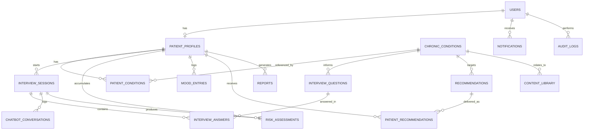

# Adaptive Psychological Monitoring and Support Platform for Chronic Disease Patients Using Conversational AI
## STEP 1 — System Architecture & Design Documentation

> Language note: All technical content in this document is written in English, as required by the project's language rule. Every artifact intended for end users (chat dialogue, UI text, notifications, recommendations) is specified to be rendered in Arabic at runtime.

---

# 1. COMPLETE SYSTEM ARCHITECTURE

## 1.1 High-Level Architecture Style

The platform follows a **modular monolith with a separated AI service layer**, which is the most practical choice for a Bachelor's graduation project: it is easier to develop, deploy, and demo than a full microservices system, while still keeping the AI/NLP workload cleanly separated so it can be scaled or replaced independently later.

```
┌─────────────────────────────────────────────────────────────────┐
│                        CLIENT LAYER                              │
│  ┌─────────────────────────┐    ┌──────────────────────────┐    │
│  │  Flutter Mobile App      │    │  Admin Web Dashboard      │    │
│  │  (Patients, Arabic UI)   │    │  (Doctors/Admins, RTL)    │    │
│  └────────────┬─────────────┘    └──────────────┬─────────────┘  │
└───────────────┼──────────────────────────────────┼───────────────┘
                 │ HTTPS / JWT                       │ HTTPS / JWT
┌────────────────▼──────────────────────────────────▼───────────────┐
│                       API GATEWAY (FastAPI)                        │
│  - Auth & RBAC          - Rate limiting        - Request routing   │
└────────────────┬──────────────────────────────────┬───────────────┘
                  │                                   │
   ┌──────────────▼──────────────┐     ┌─────────────▼──────────────┐
   │  CORE BACKEND SERVICES       │     │  AI / NLP ENGINE SERVICE     │
   │  - Auth Service               │     │  - Adaptive Interview Engine│
   │  - Patient Profile Service    │     │  - Sentiment Analysis (HF)  │
   │  - Interview Session Service  │◄───►│  - Risk Classification      │
   │  - Mood Tracking Service      │     │  - Recommendation Engine    │
   │  - Notification Service       │     │  - LLM Wrapper (rephrasing, │
   │  - Reporting/Analytics Service│     │    summarization, Arabic    │
   │  - Admin/Content Service      │     │    generation)              │
   └──────────────┬────────────────┘     └─────────────┬───────────────┘
                  │                                      │
   ┌──────────────▼──────────────────────────────────────▼───────────┐
   │                     DATA & INFRASTRUCTURE LAYER                  │
   │  - PostgreSQL (primary relational DB)                            │
   │  - Redis (optional: session cache, conversation context cache)  │
   │  - Firebase Cloud Messaging (push notifications)                 │
   │  - Object Storage (avatars, exported reports - optional)         │
   └────────────────────────────────────────────────────────────────┘
```

## 1.2 Component Responsibilities

| Component | Responsibility |
|---|---|
| Flutter Mobile App | Patient-facing app: registration, profile, chatbot interview, mood tracking, recommendations, reports, notifications. Fully Arabic, RTL layout. |
| Admin Web Dashboard | Internal tool for admins/clinical supervisors: user management, risk monitoring, interview monitoring, content/recommendation management, analytics. |
| FastAPI Backend (Core) | Business logic, authentication, CRUD operations, orchestration between mobile/admin clients and the AI engine. |
| AI/NLP Engine Service | Adaptive Interview Engine, sentiment analysis pipeline, risk scoring, recommendation logic, LLM-assisted Arabic generation. Can run as a separate FastAPI microservice or as an internal module — described as a logical service for scalability. |
| PostgreSQL | System of record for all structured data (users, sessions, answers, scores, recommendations, etc.). |
| Redis (optional) | Fast access to active conversation state/context during an ongoing interview session. |
| FCM | Delivery of Arabic push notifications (check-ins, reminders, alerts). |

## 1.3 Deployment View

```
Docker Compose (dev) / Render or Railway (prod)
├── backend-api          (FastAPI, port 8000)
├── ai-engine             (FastAPI, port 8001) -- can be merged into backend-api for simplicity
├── postgres              (PostgreSQL 15)
├── redis                 (optional)
└── nginx / reverse proxy (TLS termination)
```

For the academic version of the project, `backend-api` and `ai-engine` can be deployed as **one FastAPI application with separated routers and service modules** (`/app/services/ai_engine/...`), which satisfies the "hybrid architecture" requirement without operational overhead. The architecture diagram above still applies logically — it just maps to a single deployable unit.

## 1.4 Cross-Cutting Concerns

- **Authentication & Authorization**: JWT access + refresh tokens, role-based access control (`patient`, `admin`, `clinical_supervisor`).
- **Localization**: All user-facing strings stored/returned in Arabic; backend stores some enumerations (disease codes, risk levels) in English for engineering clarity, with Arabic labels resolved via a translation/content table.
- **Privacy & Security**: TLS in transit, encryption at rest for sensitive fields (e.g., free-text answers, mood notes), audit logging of all admin actions.
- **Observability**: Structured logging, request IDs, and an `audit_logs` table for traceability of risk-level changes and admin interventions.

---

# 2. DATABASE SCHEMA WITH RELATIONSHIPS

All tables use `UUID` primary keys (recommended for distributed-friendly IDs) and `created_at` / `updated_at` timestamps. Below is the full schema.

## 2.1 `users`

| Column | Type | Constraints |
|---|---|---|
| id | UUID | PK, default `gen_random_uuid()` |
| email | VARCHAR(255) | UNIQUE, NOT NULL |
| phone_number | VARCHAR(20) | UNIQUE, NULLABLE |
| password_hash | VARCHAR(255) | NOT NULL |
| full_name | VARCHAR(150) | NOT NULL |
| role | ENUM('patient','admin','clinical_supervisor') | NOT NULL, default `patient` |
| is_active | BOOLEAN | NOT NULL, default `true` |
| preferred_language | VARCHAR(10) | default `'ar'` |
| created_at | TIMESTAMP | NOT NULL, default now() |
| updated_at | TIMESTAMP | NOT NULL, default now() |

## 2.2 `patient_profiles`

| Column | Type | Constraints |
|---|---|---|
| id | UUID | PK |
| user_id | UUID | FK → `users.id`, UNIQUE, NOT NULL, ON DELETE CASCADE |
| date_of_birth | DATE | NULLABLE |
| gender | ENUM('male','female','other') | NULLABLE |
| disease_duration_months | INTEGER | NULLABLE |
| medications | TEXT | NULLABLE (free text or JSON array) |
| sleep_hours_avg | NUMERIC(3,1) | NULLABLE |
| activity_level | ENUM('sedentary','light','moderate','active') | NULLABLE |
| social_support_level | ENUM('none','low','medium','high') | NULLABLE |
| medical_background | TEXT | NULLABLE |
| onboarding_completed | BOOLEAN | default `false` |
| created_at | TIMESTAMP | default now() |
| updated_at | TIMESTAMP | default now() |

## 2.3 `chronic_conditions`

Reference table for disease types (master data, English codes, Arabic labels resolved via `content_library` or a `name_ar` column).

| Column | Type | Constraints |
|---|---|---|
| id | UUID | PK |
| code | VARCHAR(50) | UNIQUE, NOT NULL (e.g., `diabetes`, `cancer`, `kidney_failure`, `heart_disease`, `hypertension`, `asthma`, `other`) |
| name_en | VARCHAR(100) | NOT NULL |
| name_ar | VARCHAR(100) | NOT NULL |
| description_ar | TEXT | NULLABLE |
| is_active | BOOLEAN | default `true` |

## 2.4 `patient_conditions` (junction table — a patient may have multiple chronic conditions)

| Column | Type | Constraints |
|---|---|---|
| id | UUID | PK |
| patient_profile_id | UUID | FK → `patient_profiles.id`, NOT NULL, ON DELETE CASCADE |
| chronic_condition_id | UUID | FK → `chronic_conditions.id`, NOT NULL |
| diagnosed_at | DATE | NULLABLE |
| is_primary | BOOLEAN | default `false` |
| UNIQUE (patient_profile_id, chronic_condition_id) | | |

> Note: The original requirements list `chronic_conditions` as a single table; this design splits the *master list* (`chronic_conditions`) from the *patient assignment* (`patient_conditions`) to properly support many-to-many relationships and normalization, while keeping the originally requested table name intact.

## 2.5 `interview_sessions`

| Column | Type | Constraints |
|---|---|---|
| id | UUID | PK |
| patient_profile_id | UUID | FK → `patient_profiles.id`, NOT NULL |
| started_at | TIMESTAMP | default now() |
| ended_at | TIMESTAMP | NULLABLE |
| status | ENUM('in_progress','completed','abandoned') | default `in_progress` |
| trigger_type | ENUM('daily_checkin','manual','follow_up','scheduled') | NOT NULL |
| total_questions_asked | INTEGER | default 0 |
| session_summary_ar | TEXT | NULLABLE (LLM-generated Arabic summary) |
| risk_assessment_id | UUID | FK → `risk_assessments.id`, NULLABLE (set after scoring) |

## 2.6 `interview_questions`

Bank of question templates used/generated by the Adaptive Interview Engine. Static templates + dynamically generated (LLM-rephrased) variants are both stored here for traceability.

| Column | Type | Constraints |
|---|---|---|
| id | UUID | PK |
| chronic_condition_id | UUID | FK → `chronic_conditions.id`, NULLABLE (NULL = generic question) |
| category | ENUM('anxiety','stress','sadness','burnout','sleep','adherence','social_isolation','adaptation','general') | NOT NULL |
| question_text_ar | TEXT | NOT NULL |
| question_type | ENUM('open_text','scale_1_5','yes_no','multiple_choice') | NOT NULL |
| options_json | JSONB | NULLABLE (for multiple_choice) |
| difficulty_depth | SMALLINT | NOT NULL, default 1 (1 = surface-level, higher = deeper probing) |
| is_template | BOOLEAN | default `true` |
| created_at | TIMESTAMP | default now() |

## 2.7 `interview_answers`

| Column | Type | Constraints |
|---|---|---|
| id | UUID | PK |
| interview_session_id | UUID | FK → `interview_sessions.id`, NOT NULL, ON DELETE CASCADE |
| interview_question_id | UUID | FK → `interview_questions.id`, NULLABLE (NULL if fully dynamic/freeform question) |
| question_text_ar_snapshot | TEXT | NOT NULL (snapshot of the exact question asked, since dynamic questions are not always template-based) |
| answer_text_ar | TEXT | NULLABLE |
| answer_value_numeric | NUMERIC(5,2) | NULLABLE (for scale answers) |
| sentiment_label | VARCHAR(50) | NULLABLE (e.g., `anxious`, `sad`, `neutral`, `positive`, `frustrated`) |
| sentiment_score | NUMERIC(4,3) | NULLABLE (0–1 confidence) |
| sequence_order | INTEGER | NOT NULL |
| asked_at | TIMESTAMP | default now() |

## 2.8 `chatbot_conversations`

Stores the raw conversational turns (chat-log view), separate from the structured Q&A above, to preserve full dialogue context for memory and LLM use.

| Column | Type | Constraints |
|---|---|---|
| id | UUID | PK |
| interview_session_id | UUID | FK → `interview_sessions.id`, NOT NULL, ON DELETE CASCADE |
| sender | ENUM('bot','patient') | NOT NULL |
| message_text_ar | TEXT | NOT NULL |
| message_order | INTEGER | NOT NULL |
| created_at | TIMESTAMP | default now() |

## 2.9 `mood_entries`

Lightweight, frequent self-reported mood logs (independent of full interview sessions).

| Column | Type | Constraints |
|---|---|---|
| id | UUID | PK |
| patient_profile_id | UUID | FK → `patient_profiles.id`, NOT NULL |
| mood_value | SMALLINT | NOT NULL (e.g., 1–5 scale) |
| note_ar | TEXT | NULLABLE |
| source | ENUM('manual','interview_derived') | default `manual` |
| recorded_at | TIMESTAMP | default now() |

## 2.10 `risk_assessments`

| Column | Type | Constraints |
|---|---|---|
| id | UUID | PK |
| patient_profile_id | UUID | FK → `patient_profiles.id`, NOT NULL |
| interview_session_id | UUID | FK → `interview_sessions.id`, NOT NULL, UNIQUE |
| risk_level | SMALLINT | NOT NULL, CHECK (risk_level BETWEEN 1 AND 5) |
| anxiety_score | NUMERIC(4,2) | NOT NULL |
| stress_score | NUMERIC(4,2) | NOT NULL |
| sadness_score | NUMERIC(4,2) | NOT NULL |
| burnout_score | NUMERIC(4,2) | NOT NULL |
| sleep_quality_score | NUMERIC(4,2) | NOT NULL |
| adherence_score | NUMERIC(4,2) | NOT NULL |
| composite_score | NUMERIC(5,2) | NOT NULL |
| explanation_ar | TEXT | NOT NULL (human-readable Arabic explanation of why this level was assigned) |
| explanation_factors_json | JSONB | NOT NULL (machine-readable breakdown of contributing factors and weights) |
| created_at | TIMESTAMP | default now() |

## 2.11 `recommendations`

Master catalog of recommendation content.

| Column | Type | Constraints |
|---|---|---|
| id | UUID | PK |
| category | ENUM('breathing_exercise','relaxation','sleep_tip','stress_management','motivational','educational','professional_help') | NOT NULL |
| chronic_condition_id | UUID | FK → `chronic_conditions.id`, NULLABLE (NULL = generic) |
| applicable_risk_levels | SMALLINT[] | NOT NULL (e.g., `{2,3,4}`) |
| title_ar | VARCHAR(255) | NOT NULL |
| content_ar | TEXT | NOT NULL |
| media_url | VARCHAR(500) | NULLABLE (audio for breathing exercises, etc.) |
| is_active | BOOLEAN | default `true` |
| created_at | TIMESTAMP | default now() |

## 2.12 `patient_recommendations` (junction — recommendations delivered to a patient)

| Column | Type | Constraints |
|---|---|---|
| id | UUID | PK |
| patient_profile_id | UUID | FK → `patient_profiles.id`, NOT NULL |
| recommendation_id | UUID | FK → `recommendations.id`, NOT NULL |
| risk_assessment_id | UUID | FK → `risk_assessments.id`, NULLABLE |
| delivered_at | TIMESTAMP | default now() |
| is_viewed | BOOLEAN | default `false` |
| is_helpful_feedback | BOOLEAN | NULLABLE (patient feedback) |

## 2.13 `notifications`

| Column | Type | Constraints |
|---|---|---|
| id | UUID | PK |
| user_id | UUID | FK → `users.id`, NOT NULL |
| type | ENUM('daily_checkin','follow_up','mood_reminder','recommendation_alert','engagement','risk_alert_admin') | NOT NULL |
| title_ar | VARCHAR(255) | NOT NULL |
| body_ar | TEXT | NOT NULL |
| is_read | BOOLEAN | default `false` |
| sent_at | TIMESTAMP | NULLABLE |
| scheduled_for | TIMESTAMP | NULLABLE |
| status | ENUM('pending','sent','failed') | default `pending` |
| created_at | TIMESTAMP | default now() |

## 2.14 `reports`

Pre-aggregated/generated reports (cached for performance and historical record).

| Column | Type | Constraints |
|---|---|---|
| id | UUID | PK |
| patient_profile_id | UUID | FK → `patient_profiles.id`, NOT NULL |
| report_type | ENUM('daily','weekly','monthly') | NOT NULL |
| period_start | DATE | NOT NULL |
| period_end | DATE | NOT NULL |
| summary_ar | TEXT | NOT NULL |
| metrics_json | JSONB | NOT NULL (mood trend, risk progression, adherence stats, etc.) |
| generated_at | TIMESTAMP | default now() |

## 2.15 `content_library`

General-purpose educational/static content (also used for Arabic label resolution if needed).

| Column | Type | Constraints |
|---|---|---|
| id | UUID | PK |
| content_type | ENUM('article','tip','faq','onboarding_text','ui_label') | NOT NULL |
| key | VARCHAR(150) | NOT NULL (lookup key) |
| chronic_condition_id | UUID | FK → `chronic_conditions.id`, NULLABLE |
| title_ar | VARCHAR(255) | NULLABLE |
| body_ar | TEXT | NOT NULL |
| is_published | BOOLEAN | default `true` |
| created_at | TIMESTAMP | default now() |
| updated_at | TIMESTAMP | default now() |

## 2.16 `audit_logs`

| Column | Type | Constraints |
|---|---|---|
| id | UUID | PK |
| actor_user_id | UUID | FK → `users.id`, NULLABLE (NULL = system) |
| action | VARCHAR(100) | NOT NULL (e.g., `risk_level_override`, `recommendation_published`, `user_deactivated`) |
| target_table | VARCHAR(100) | NOT NULL |
| target_id | UUID | NOT NULL |
| metadata_json | JSONB | NULLABLE |
| created_at | TIMESTAMP | default now() |

## 2.17 Relationship Summary

- `users` 1 — 1 `patient_profiles`
- `patient_profiles` 1 — N `patient_conditions` N — 1 `chronic_conditions`
- `patient_profiles` 1 — N `interview_sessions`
- `interview_sessions` 1 — N `interview_answers`
- `interview_sessions` 1 — N `chatbot_conversations`
- `interview_sessions` 1 — 1 `risk_assessments`
- `interview_questions` N — 1 `chronic_conditions` (nullable)
- `interview_answers` N — 1 `interview_questions` (nullable)
- `patient_profiles` 1 — N `mood_entries`
- `patient_profiles` 1 — N `risk_assessments`
- `patient_profiles` 1 — N `patient_recommendations` N — 1 `recommendations`
- `recommendations` N — 1 `chronic_conditions` (nullable)
- `users` 1 — N `notifications`
- `patient_profiles` 1 — N `reports`
- `content_library` N — 1 `chronic_conditions` (nullable)
- `audit_logs` N — 1 `users` (nullable, actor)

---

# 3. ER DIAGRAM DESCRIPTION

Below is a Mermaid ER diagram representing the core entities and relationships described above (simplified cardinalities for readability):



### Narrative Description

1. **A `user`** account is created for every person on the platform (patients, admins, clinical supervisors). For patients, the account links 1:1 to a **`patient_profile`**, which stores health/lifestyle information.
2. **A `patient_profile`** can be associated with one or more **`chronic_conditions`** through the **`patient_conditions`** linking table, allowing co-morbidities.
3. **A `patient_profile`** initiates many **`interview_sessions`** over time (daily check-ins, follow-ups, manual sessions).
4. **Each `interview_session`** generates a sequence of **`interview_answers`** (structured Q&A data) and a parallel raw log in **`chatbot_conversations`** (full dialogue for context/memory and LLM summarization).
5. **`interview_questions`** form the question bank; each may be tied to a specific **`chronic_condition`** (disease-aware questions) or be generic.
6. **At the end of each session**, exactly one **`risk_assessment`** is produced, capturing sub-scores (anxiety, stress, sadness, burnout, sleep, adherence), a composite score, the resulting **risk level (1–5)**, and an Arabic explanation.
7. **`risk_assessments`** (directly or via category/condition matching) drive **`patient_recommendations`**, which link **patients** to entries in the **`recommendations`** catalog (which may be condition-specific).
8. **`mood_entries`** provide a lightweight, high-frequency channel for mood tracking outside full interviews — used for trend charts.
9. **`notifications`** are sent to `users` (check-ins, reminders, alerts) and tracked for delivery status.
10. **`reports`** aggregate data per patient over daily/weekly/monthly periods for dashboards and analytics.
11. **`content_library`** stores educational/static Arabic content, optionally tied to a chronic condition.
12. **`audit_logs`** record administrative and system actions for traceability and ethics/compliance.

---

# 4. API ENDPOINT DESIGN

Base URL: `/api/v1`. All endpoints (except auth) require `Authorization: Bearer <JWT>`. Responses use a consistent envelope: `{ "success": bool, "data": ..., "message_ar": "..." }`.

## 4.1 Authentication

| Method | Endpoint | Description |
|---|---|---|
| POST | `/auth/register` | Register a new patient account |
| POST | `/auth/login` | Login, returns access + refresh tokens |
| POST | `/auth/refresh` | Refresh access token |
| POST | `/auth/logout` | Invalidate refresh token |
| POST | `/auth/change-password` | Change password |
| POST | `/auth/forgot-password` | Request password reset (email/OTP) |
| POST | `/auth/reset-password` | Reset password via token/OTP |

## 4.2 Patient Profile

| Method | Endpoint | Description |
|---|---|---|
| GET | `/patients/me` | Get current patient profile |
| PUT | `/patients/me` | Update profile (lifestyle, sleep, activity, etc.) |
| GET | `/patients/me/conditions` | List chronic conditions for the patient |
| POST | `/patients/me/conditions` | Add a chronic condition |
| DELETE | `/patients/me/conditions/{condition_id}` | Remove a chronic condition |
| GET | `/conditions` | List all available chronic conditions (master list) |

## 4.3 Adaptive Interview / Chatbot

| Method | Endpoint | Description |
|---|---|---|
| POST | `/interviews/start` | Start a new interview session (returns first question) |
| POST | `/interviews/{session_id}/answer` | Submit an answer; engine returns next question or end-of-session signal |
| GET | `/interviews/{session_id}` | Get session details/status |
| GET | `/interviews/{session_id}/conversation` | Get full chat transcript (Arabic) |
| POST | `/interviews/{session_id}/end` | Force-end a session (e.g., user exits early) |
| GET | `/interviews/history` | List past sessions for the patient |

## 4.4 Mood Tracking

| Method | Endpoint | Description |
|---|---|---|
| POST | `/mood-entries` | Log a quick mood entry |
| GET | `/mood-entries` | List mood entries (with date range filters) |
| GET | `/mood-entries/trend` | Aggregated mood trend data for charts |

## 4.5 Risk & Assessment

| Method | Endpoint | Description |
|---|---|---|
| GET | `/risk-assessments/latest` | Get the patient's most recent risk assessment |
| GET | `/risk-assessments` | List historical risk assessments |
| GET | `/risk-assessments/{id}` | Get a specific assessment with full explanation |

## 4.6 Recommendations

| Method | Endpoint | Description |
|---|---|---|
| GET | `/recommendations/me` | Get current/active recommendations for the patient |
| POST | `/recommendations/{id}/viewed` | Mark a recommendation as viewed |
| POST | `/recommendations/{id}/feedback` | Submit helpful/not-helpful feedback |

## 4.7 Notifications

| Method | Endpoint | Description |
|---|---|---|
| GET | `/notifications` | List notifications for current user |
| POST | `/notifications/{id}/read` | Mark notification as read |
| POST | `/devices/register` | Register FCM device token |

## 4.8 Reports & Analytics

| Method | Endpoint | Description |
|---|---|---|
| GET | `/reports/daily` | Get/generate today's summary |
| GET | `/reports/weekly` | Get/generate weekly report |
| GET | `/reports/monthly` | Get/generate monthly report |
| GET | `/reports/risk-progression` | Risk level history over time (for charts) |

## 4.9 Admin Endpoints (role = admin / clinical_supervisor)

| Method | Endpoint | Description |
|---|---|---|
| GET | `/admin/users` | List/search all users |
| GET | `/admin/users/{id}` | Get user detail incl. profile and risk history |
| PATCH | `/admin/users/{id}/status` | Activate/deactivate a user |
| GET | `/admin/risk-monitoring` | List patients sorted/filtered by risk level |
| GET | `/admin/interviews/{session_id}` | Inspect a full interview session |
| GET | `/admin/recommendations` | List recommendation catalog |
| POST | `/admin/recommendations` | Create a new recommendation entry |
| PUT | `/admin/recommendations/{id}` | Update recommendation content |
| DELETE | `/admin/recommendations/{id}` | Deactivate a recommendation |
| GET | `/admin/content-library` | List/manage educational content |
| POST | `/admin/content-library` | Create content entry |
| GET | `/admin/analytics/overview` | Aggregate platform-wide analytics |
| GET | `/admin/audit-logs` | View audit log entries |

---

# 5. ADAPTIVE INTERVIEW ENGINE ARCHITECTURE

## 5.1 Goals

The engine must produce a **different, context-aware interview each time**, behaving as a structured psychological interviewer rather than an open-ended chatbot.

## 5.2 Core Components

```
┌────────────────────────────────────────────────────────────────┐
│                  ADAPTIVE INTERVIEW ENGINE                       │
│                                                                    │
│  ┌──────────────┐   ┌───────────────────┐   ┌─────────────────┐ │
│  │ Context        │   │ Question Selector  │   │ Depth/Termination│ │
│  │ Manager        │──▶│ (Rule-Based Core)  │──▶│ Controller       │ │
│  └──────┬─────────┘   └─────────┬──────────┘   └────────┬─────────┘ │
│         │                        │                        │          │
│         ▼                        ▼                        ▼          │
│  ┌──────────────┐   ┌───────────────────┐   ┌─────────────────┐ │
│  │ Patient State  │   │ Disease Knowledge  │   │ LLM Wrapper       │ │
│  │ (profile, hist.)│  │ Layer              │   │ (rephrase Arabic, │ │
│  │                │   │                    │   │  summarize, etc.) │ │
│  └────────────────┘   └────────────────────┘   └───────────────────┘ │
└────────────────────────────────────────────────────────────────┘
```

### 5.2.1 Context Manager

Maintains the working state for the active session:
- Patient profile snapshot (disease(s), duration, lifestyle data).
- Last N sessions' summaries and risk levels (long-term memory).
- Current session's Q&A so far (short-term memory).
- Running emotional indicators (sentiment scores accumulated this session).
- Topics already covered (to avoid repetition) and topics flagged for deeper exploration.

### 5.2.2 Question Selector (Rule-Based Core)

A rules/decision-table engine that, at each turn, computes the **next topic category** to explore based on:

- Disease-specific priority topics from the **Disease Knowledge Layer** (e.g., for kidney failure patients, prioritize isolation/exhaustion topics).
- Categories not yet covered in this session.
- Categories where the patient's last answer showed a notable sentiment signal (e.g., a sad/anxious answer about sleep triggers a deeper sleep-quality follow-up).
- Patient's historical risk level (higher historical risk → engine starts with slightly more probing questions).

Pseudo-decision logic:

```
function select_next_category(context):
    candidates = disease_knowledge.get_priority_categories(context.conditions)
    candidates = remove_covered(candidates, context.covered_categories)

    if context.last_answer.sentiment in [anxious, sad, frustrated] and score > threshold:
        return escalate_category(context.last_answer.category)  # go deeper on same topic

    if context.session_risk_signal == "high":
        return highest_priority_uncovered(candidates)

    return next_uncovered_in_priority_order(candidates)
```

### 5.2.3 Question Generation

For the selected category, the engine:
1. Retrieves a base question template from `interview_questions` (filtered by category + chronic_condition_id).
2. If the template needs personalization (e.g., referencing the patient's medication or previous answer), the **LLM Wrapper** rephrases it in natural Arabic, injecting context — but the *intent/category* of the question is always determined by the rule-based selector, not the LLM.
3. The final Arabic question text is stored as a snapshot in `interview_answers.question_text_ar_snapshot` for traceability.

### 5.2.4 Depth & Termination Controller

Controls how long the interview continues:

- **Minimum questions per session**: e.g., 5 (covers core categories briefly for stable patients).
- **Maximum questions per session**: e.g., 15 (hard cap to avoid fatigue).
- **Early termination conditions**:
  - All priority categories covered with consistently low-risk signals → end session ("stable" path, shorter interview).
  - Patient explicitly indicates wanting to stop.
- **Extended exploration conditions**:
  - Risk signals accumulate above a threshold → engine continues into categories not originally prioritized, asking clarifying/follow-up questions until either (a) the picture is clear enough to score confidently, or (b) the max-question cap is reached.
- **Insufficient information handling**: If an answer is too short/ambiguous (e.g., one-word Arabic reply with no detectable sentiment), the engine issues a clarification question on the same topic before moving on (limited to 1 clarification per topic to avoid loops).

### 5.2.5 Session Closure

When termination conditions are met:
1. Engine sends a closing Arabic message (warm, supportive tone).
2. `interview_sessions.status = completed`, `ended_at` set.
3. Session handed to the **Sentiment Analysis** and **Risk Classification** pipelines (see Sections 7–8).
4. LLM Wrapper generates `session_summary_ar`.

---

# 6. DISEASE KNOWLEDGE LAYER DESIGN

## 6.1 Storage Approach

The Disease Knowledge Layer is implemented as structured data: a combination of the `chronic_conditions`, `interview_questions` (with `chronic_condition_id`), and `recommendations` tables, plus a **JSON configuration object per disease** used by the rule-based Question Selector for prioritization. This JSON can be stored in a dedicated column (e.g., `chronic_conditions.knowledge_config_json JSONB`) or as a config file loaded at startup — JSONB in the DB is recommended so admins can edit it via the dashboard without redeployment.

## 6.2 Schema of `knowledge_config_json`

```json
{
  "disease_code": "diabetes",
  "priority_categories": ["adherence", "burnout", "stress", "anxiety", "sleep"],
  "psychological_burdens": [
    "treatment_fatigue",
    "burnout",
    "fear_of_complications",
    "lifestyle_restriction_frustration"
  ],
  "emotional_patterns": {
    "treatment_fatigue": {
      "typical_signals": ["كثرة تكرار الفحوصات تتعبني", "تعبت من النظام الغذائي"],
      "follow_up_category": "burnout"
    }
  },
  "follow_up_question_pool_tags": ["diabetes_adherence", "diabetes_lifestyle", "diabetes_fear"],
  "recommendation_category_weights": {
    "stress_management": 1.2,
    "educational": 1.1,
    "motivational": 1.0
  },
  "risk_indicators": [
    "skipped_medication_mentions",
    "repeated_negative_sentiment_on_adherence",
    "expressions_of_hopelessness"
  ]
}
```

## 6.3 Example Configurations (per requirements)

| Disease | Priority Categories | Key Psychological Concerns | Notable Risk Indicators |
|---|---|---|---|
| Diabetes | adherence, burnout, stress | Treatment fatigue, burnout, fear of complications, lifestyle restriction frustration | Skipped medication mentions, repeated frustration about diet |
| Cancer | anxiety, sadness, adaptation | Fear of recurrence, anxiety, uncertainty, emotional distress | Statements of hopelessness, recurrence fear language |
| Kidney Failure | social_isolation, burnout, sleep | Isolation, exhaustion, reduced motivation, emotional burden of dialysis | Withdrawal from social activities, exhaustion language tied to dialysis days |
| Heart Disease | anxiety, stress | Fear of relapse, health anxiety, stress | Catastrophizing about symptoms, avoidance of activity due to fear |
| Hypertension | stress, adherence | Stress-related, medication adherence concerns | Stress-triggered symptom reports |
| Asthma | anxiety, stress | Anxiety around attacks, activity limitation | Avoidance behavior, panic-related language |

## 6.4 How the Engine Uses This Layer

- **Question Selection**: `priority_categories` seeds the initial ordering of topics for a session.
- **Escalation**: `emotional_patterns` maps detected sentiment/keyword patterns to a `follow_up_category` for deeper probing.
- **Risk Scoring**: `risk_indicators` feed directly into the Risk Assessment Logic (Section 7) as condition-specific boosting rules.
- **Recommendations**: `recommendation_category_weights` bias the Recommendation Engine (Section 8) toward categories most relevant to that disease.

---

# 7. RISK ASSESSMENT LOGIC

## 7.1 Inputs

For each completed `interview_session`, the Risk Engine receives:
- All `interview_answers` with `sentiment_label` and `sentiment_score` (from the sentiment analysis pipeline).
- Numeric scale answers (e.g., sleep quality 1–5, adherence 1–5).
- Patient profile context (disease(s), historical risk levels from prior `risk_assessments`).
- Disease-specific `risk_indicators` from the Knowledge Layer.

## 7.2 Sub-Score Computation

Each of the six tracked dimensions — **anxiety, stress, sadness, burnout, sleep_quality, adherence** — is computed on a normalized 0–10 scale:

```
dimension_score = base_from_direct_answers(dimension)
                   + sentiment_contribution(dimension)
                   + disease_specific_adjustment(dimension)
```

- **`base_from_direct_answers`**: For dimensions with direct scale questions (e.g., sleep quality), use the patient's numeric answer (rescaled to 0–10; for sleep, inverted so poor sleep = higher "risk score").
- **`sentiment_contribution`**: For each free-text answer tagged with a sentiment relevant to the dimension (e.g., sentiment = `anxious` contributes to the `anxiety` dimension), add a weighted contribution proportional to `sentiment_score` (confidence).
- **`disease_specific_adjustment`**: If the disease's `risk_indicators` are detected in the session (e.g., "skipped medication" language for a diabetic patient), apply an additive boost to the relevant dimension (e.g., `adherence` and `burnout`).

## 7.3 Composite Score

```
composite_score = w1*anxiety + w2*stress + w3*sadness + w4*burnout
                 + w5*(10 - sleep_quality_score)   // poor sleep increases risk
                 + w6*(10 - adherence_score)       // poor adherence increases risk
```

Default suggested weights (sum = 1.0, tunable): `w1=0.20 (anxiety), w2=0.20 (stress), w3=0.15 (sadness), w4=0.20 (burnout), w5=0.125 (sleep), w6=0.125 (adherence)`.

`composite_score` is normalized to a **0–100 scale** for readability.

## 7.4 Trend Adjustment

The engine also considers **trajectory**: if the current `composite_score` is similar to or higher than the previous 2–3 assessments (a worsening or persistently poor trend), the risk level may be escalated by one tier even if the absolute score alone would map to a lower level. This implements the requirement: *"Repeated negative emotional indicators → Moderate Risk"* and *"Significant deterioration → High Risk"*.

## 7.5 Mapping to Risk Levels

| Composite Score Range | Trend Condition | Risk Level |
|---|---|---|
| 0–20 | Stable or improving | **Level 1 – Stable** |
| 21–40 | Stable | **Level 2 – Mild Concern** |
| 21–40 | Worsening trend (2+ consecutive increases) | **Level 3 – Moderate Risk** |
| 41–65 | Any | **Level 3 – Moderate Risk** |
| 41–65 | Worsening trend or explicit hopelessness indicators | **Level 4 – High Risk** |
| 66–85 | Any | **Level 4 – High Risk** |
| 86–100 OR explicit crisis-language detected (e.g., self-harm references) | Any | **Level 5 – Critical Attention Required** |

> Note: Detection of explicit crisis/self-harm language always forces at minimum Level 5, regardless of composite score, and immediately triggers an admin notification (`risk_alert_admin`) and a recommendation in category `professional_help`.

## 7.6 Explainability

`risk_assessments.explanation_factors_json` stores a structured breakdown, e.g.:

```json
{
  "composite_score": 58.3,
  "dimension_scores": {
    "anxiety": 7.2, "stress": 6.5, "sadness": 4.0,
    "burnout": 6.8, "sleep_quality": 3.5, "adherence": 6.0
  },
  "top_contributors": [
    {"dimension": "anxiety", "reason": "high sentiment confidence on 3 answers about disease progression fear"},
    {"dimension": "sleep_quality", "reason": "self-reported sleep score of 2/5"}
  ],
  "trend": "worsening_2_sessions",
  "disease_adjustments_applied": ["kidney_failure_isolation_boost"]
}
```

`explanation_ar` is a natural-language Arabic rendering of this breakdown (LLM-assisted), e.g.: *"تم تصنيفك في المستوى 3 (خطر متوسط) بسبب ارتفاع مستوى القلق وضعف جودة النوم خلال هذا الأسبوع، مع استمرار هذا النمط منذ جلستين سابقتين."*

---

# 8. RECOMMENDATION ENGINE LOGIC

## 8.1 Inputs

- The latest `risk_assessment` (level + dimension scores).
- The patient's chronic condition(s) and the Knowledge Layer's `recommendation_category_weights`.
- Recently delivered recommendations (to avoid repetition — track via `patient_recommendations`).
- Patient feedback history (`is_helpful_feedback`) to deprioritize categories the patient marked unhelpful.

## 8.2 Selection Algorithm

```
function select_recommendations(patient, risk_assessment):
    candidates = recommendations WHERE
        risk_assessment.risk_level IN applicable_risk_levels
        AND (chronic_condition_id IS NULL OR chronic_condition_id IN patient.conditions)
        AND is_active = true
        AND NOT recently_delivered(patient, recommendation, days=7)

    # Score candidates
    for each candidate:
        score = base_priority(candidate.category)
        score *= disease_weight(candidate.category, patient.conditions)
        score += dimension_match_bonus(candidate.category, risk_assessment.dimension_scores)
        score -= feedback_penalty(patient, candidate.category)

    return top_N(candidates, N=3, sorted_by=score_desc)
```

## 8.3 Category-to-Risk Mapping (Baseline Rules)

| Risk Level | Recommended Categories |
|---|---|
| 1 – Stable | `motivational`, `educational` |
| 2 – Mild Concern | `relaxation`, `sleep_tip` (if sleep dimension elevated), `motivational` |
| 3 – Moderate Risk | `breathing_exercise`, `stress_management`, `relaxation` |
| 4 – High Risk | `stress_management`, `breathing_exercise`, `professional_help` (informational tone) |
| 5 – Critical | `professional_help` (priority), plus immediate supportive `motivational` content; admin alert triggered |

## 8.4 Dimension-Specific Targeting

- If `sleep_quality_score` is the dominant contributor → prioritize `sleep_tip`.
- If `anxiety` or `stress` dominate → prioritize `breathing_exercise` / `stress_management`.
- If `burnout` or `adherence` dominate (common in diabetes/kidney failure) → prioritize `educational` content reframing treatment routines + `motivational` content.
- If `sadness` dominates with worsening trend → prioritize `professional_help` framing alongside `relaxation`.

## 8.5 Delivery & Tracking

- Selected recommendations are written to `patient_recommendations` and surfaced via the mobile app's "Recommendations" screen, plus optionally pushed as a `recommendation_alert` notification.
- `is_viewed` and `is_helpful_feedback` feed back into future selection (Section 8.2).

## 8.6 Ethical Guardrails

- The Recommendation Engine **never produces diagnostic statements or medication advice**. All `educational`/`professional_help` content is pre-authored (in `recommendations`/`content_library`) and reviewed by admins — the AI only *selects* among vetted content, it does not generate new medical guidance.
- `professional_help` content always includes Arabic phrasing encouraging contact with a qualified healthcare provider and, where configured, local mental health resources.

---

# 9. AI WORKFLOW (END-TO-END)

```
┌────────────────────────────────────────────────────────────────────┐
│ 1. Session Trigger                                                    │
│    - Scheduled (daily check-in) OR manual (patient opens chatbot)     │
└───────────────────────────┬───────────────────────────────────────────┘
                             ▼
┌────────────────────────────────────────────────────────────────────┐
│ 2. Context Assembly (Context Manager)                                 │
│    - Load patient profile, conditions, history, last risk level       │
└───────────────────────────┬───────────────────────────────────────────┘
                             ▼
┌────────────────────────────────────────────────────────────────────┐
│ 3. Question Selection (Rule-Based Question Selector)                  │
│    - Pick next category using Disease Knowledge Layer + context       │
└───────────────────────────┬───────────────────────────────────────────┘
                             ▼
┌────────────────────────────────────────────────────────────────────┐
│ 4. Question Delivery                                                   │
│    - Retrieve/template question, optionally LLM-rephrase in Arabic     │
│    - Store snapshot, send to patient via chat                          │
└───────────────────────────┬───────────────────────────────────────────┘
                             ▼
┌────────────────────────────────────────────────────────────────────┐
│ 5. Patient Response                                                    │
└───────────────────────────┬───────────────────────────────────────────┘
                             ▼
┌────────────────────────────────────────────────────────────────────┐
│ 6. Sentiment Analysis (Hugging Face Arabic model)                      │
│    - Classify: anxiety/sadness/stress/frustration/burnout/positive     │
│    - Attach sentiment_label + sentiment_score to the answer            │
└───────────────────────────┬───────────────────────────────────────────┘
                             ▼
┌────────────────────────────────────────────────────────────────────┐
│ 7. Context Update                                                      │
│    - Update covered categories, emotional indicator accumulators       │
│    - Check for insufficient-info → trigger clarification (loop to 3)  │
└───────────────────────────┬───────────────────────────────────────────┘
                             ▼
              ┌──────────────┴──────────────┐
              │ Termination conditions met?  │
              └───────┬───────────────┬──────┘
                  No  │               │ Yes
                       ▼               ▼
              (loop to step 3)  ┌────────────────────────────────────┐
                                 │ 8. Session Closure                  │
                                 │   - LLM generates session_summary_ar│
                                 └──────────────┬─────────────────────┘
                                                  ▼
                                 ┌────────────────────────────────────┐
                                 │ 9. Risk Classification              │
                                 │   - Compute dimension/composite      │
                                 │   - Map to Level 1–5 + explanation   │
                                 │   - LLM renders explanation_ar       │
                                 └──────────────┬─────────────────────┘
                                                  ▼
                                 ┌────────────────────────────────────┐
                                 │ 10. Recommendation Engine            │
                                 │   - Select top recommendations       │
                                 └──────────────┬─────────────────────┘
                                                  ▼
                                 ┌────────────────────────────────────┐
                                 │ 11. Notifications                    │
                                 │   - Patient: recommendation alert    │
                                 │   - Admin: risk_alert if Level ≥4    │
                                 └────────────────────────────────────┘
```

## 9.1 Technology Mapping per Stage

| Stage | Technology |
|---|---|
| Question selection, depth control, termination | Rule-based logic (Python, decision tables / config-driven) |
| Sentiment analysis | Hugging Face Transformers, Arabic sentiment/emotion model (e.g., AraBERT-based fine-tuned classifier) |
| Question rephrasing, session summary, explanation text | LLM (used selectively, with strict prompt templates constraining output to Arabic, supportive tone, no diagnosis) |
| Risk classification | Rule-based scoring (Python) |
| Recommendation selection | Rule-based scoring over `recommendations` catalog |
| Conversation memory | PostgreSQL (`chatbot_conversations`, `interview_sessions`) + optional Redis cache for active session |

## 9.2 LLM Prompt Governance (Safety)

All LLM calls use a fixed system prompt enforcing:
- Output strictly in Arabic.
- Supportive, non-judgmental tone.
- No medical diagnosis, no medication advice, no definitive medical claims.
- If the LLM detects the user expressing self-harm intent, it must NOT attempt to handle this itself — it returns a flag that the backend uses to immediately trigger Level 5 classification and the `professional_help` / admin alert pathway (Section 7.5).

---

# 10. MOBILE APP STRUCTURE (Flutter)

## 10.1 Folder Structure

```
lib/
├── main.dart
├── core/
│   ├── theme/                  # RTL, Arabic fonts, color palette
│   ├── localization/           # ar.json (primary), routing for strings
│   ├── network/                # Dio/http client, interceptors (JWT)
│   ├── constants/
│   └── utils/
├── data/
│   ├── models/                 # User, PatientProfile, InterviewSession, RiskAssessment, etc.
│   ├── repositories/           # AuthRepository, InterviewRepository, MoodRepository, ...
│   └── services/                # api_service.dart, fcm_service.dart, storage_service.dart
├── domain/
│   └── use_cases/                # StartInterview, SubmitAnswer, GetRecommendations, ...
├── presentation/
│   ├── auth/
│   │   ├── login_screen.dart
│   │   └── register_screen.dart
│   ├── onboarding/
│   │   └── profile_setup_screen.dart      # disease, lifestyle, sleep, activity
│   ├── home/
│   │   └── home_screen.dart               # dashboard: mood, risk badge, quick actions
│   ├── chat/
│   │   ├── chat_screen.dart                # adaptive interview UI
│   │   └── widgets/ (message_bubble, typing_indicator, scale_input, etc.)
│   ├── mood/
│   │   └── mood_tracker_screen.dart
│   ├── recommendations/
│   │   └── recommendations_screen.dart
│   ├── reports/
│   │   ├── reports_screen.dart
│   │   └── widgets/ (mood_trend_chart.dart, risk_progression_chart.dart -- fl_chart)
│   ├── notifications/
│   │   └── notifications_screen.dart
│   └── profile/
│       └── profile_screen.dart
├── state/                        # Provider/Riverpod/Bloc (state management TBD in Step 4)
└── widgets/                       # shared widgets (Arabic-aware buttons, cards, etc.)
```

## 10.2 Key Screens (Arabic UI)

| Screen | Purpose |
|---|---|
| تسجيل الدخول / إنشاء حساب (Login/Register) | Auth flows |
| إعداد الملف الشخصي (Profile Setup) | Disease type(s), duration, medications, lifestyle |
| الرئيسية (Home) | Current risk badge, daily check-in prompt, quick mood log |
| المحادثة التفاعلية (Adaptive Chat) | One-question-at-a-time chatbot interview |
| تتبع الحالة المزاجية (Mood Tracker) | Quick mood logging, history |
| التوصيات (Recommendations) | Personalized exercises/tips, feedback buttons |
| التقارير (Reports) | Daily/weekly/monthly summaries, charts (fl_chart) |
| الإشعارات (Notifications) | List of notifications, read/unread |
| الملف الشخصي (Profile) | Edit profile, settings, logout |

## 10.3 RTL & Localization Notes

- App-wide `Directionality: rtl` and Arabic font (e.g., Cairo, Tajawal) configured in `core/theme`.
- All static UI strings sourced from `core/localization/ar.json` — no hard-coded English UI text.
- Dynamic content (chat messages, recommendations, notifications) arrives pre-localized in Arabic from the backend.

---

# 11. ADMIN DASHBOARD STRUCTURE

## 11.1 Technology Note

Not specified in the stack; a lightweight web admin (e.g., React + a charting library, or even a server-rendered FastAPI + Jinja2 admin for minimal scope) is appropriate. The structure below is technology-agnostic and will be finalized with concrete tooling in Step 5.

## 11.2 Page Structure

```
/admin
├── /login
├── /dashboard                # Overview: active users, avg risk level, alerts today
├── /users
│   ├── /users/:id             # Profile, conditions, interview history, risk history
├── /risk-monitoring           # Sortable/filterable list by risk level, with alerts highlighted
├── /interviews
│   └── /interviews/:session_id  # Transcript + computed risk breakdown for review
├── /recommendations
│   ├── /recommendations/new
│   └── /recommendations/:id/edit
├── /content-library
│   ├── /content-library/new
│   └── /content-library/:id/edit
├── /analytics
│   ├── overall mood/risk trends across the platform
│   ├── distribution of risk levels
│   └── engagement metrics (sessions per week, notification open rates)
└── /audit-logs
```

## 11.3 RTL Considerations

The admin dashboard also targets Arabic-speaking staff and should support RTL layout and Arabic labels, while internal data (IDs, enums, technical fields) may remain in English for clarity to engineering/clinical staff — consistent with the project's language rule.

---

# 12. DEVELOPMENT ROADMAP

| Step | Scope | Key Deliverables |
|---|---|---|
| **Step 1 (this document)** | Architecture & Design | System architecture, DB schema, ER diagram, API design, AI engine design, knowledge layer, risk/recommendation logic, AI workflow, mobile/admin structure, roadmap |
| **Step 2** | Backend Development | FastAPI project setup, PostgreSQL models/migrations (Alembic), auth (JWT), patient profile CRUD, interview session endpoints (with placeholder/stubbed AI logic), notifications scaffolding |
| **Step 3** | AI Engine Development | Disease Knowledge Layer data seeding, Adaptive Interview Engine (rule-based selector + termination logic), Arabic sentiment analysis integration (Hugging Face), risk classification module, recommendation engine, LLM wrapper for rephrasing/summarization |
| **Step 4** | Flutter Mobile Application | Auth & onboarding screens, adaptive chat UI, mood tracker, recommendations screen, reports/charts (fl_chart), notifications (FCM integration), full Arabic RTL UI |
| **Step 5** | Admin Dashboard | User management, risk monitoring, interview review, content/recommendation management, analytics views, audit log viewer |
| **Step 6** | Testing | Unit tests (risk scoring, recommendation logic, interview engine rules), integration tests (API endpoints), sentiment model evaluation, mobile widget tests, end-to-end interview scenario tests |
| **Step 7** | Documentation | Final architecture write-up, API documentation (OpenAPI/Swagger refinement), setup/deployment guide (Docker), user manual (Arabic), academic report sections (methodology, results, ethics) |

---

## Summary of Step 1 Deliverables

This document provides:
1. ✅ Complete system architecture (modular monolith + AI service layer, deployment view, cross-cutting concerns)
2. ✅ Full database schema (14+ tables with types, constraints, PK/FK)
3. ✅ ER diagram (Mermaid) + narrative relationship description
4. ✅ Complete REST API endpoint design across all feature areas
5. ✅ Adaptive Interview Engine architecture (context manager, rule-based selector, depth/termination controller, LLM wrapper)
6. ✅ Disease Knowledge Layer design with JSON schema and example configurations for diabetes, cancer, kidney failure, heart disease, hypertension, asthma
7. ✅ Risk Assessment Logic (sub-scores, composite score, trend adjustment, level mapping, explainability)
8. ✅ Recommendation Engine Logic (selection algorithm, category mappings, ethical guardrails)
9. ✅ End-to-end AI Workflow diagram with technology mapping per stage
10. ✅ Mobile App structure (Flutter folder structure, screens, RTL/localization)
11. ✅ Admin Dashboard structure (pages, RTL considerations)
12. ✅ Development Roadmap (Steps 2–7)

**Status: STEP 1 COMPLETE. Awaiting review and explicit approval before proceeding to Step 2 (Backend Development).**
